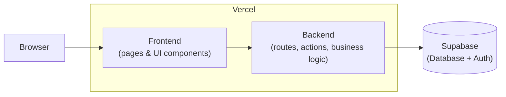

# Architecture

This is a single Next.js application deployed on Vercel — there is no separate backend server or repo. "Frontend/backend separation" here means strict import boundaries _within_ that one app, not separate deployments. See `CLAUDE.md` for the enforced rules; this document is the picture.

## Diagram

## Layers and how they relate

| Layer              | Where                                    | Responsibility                                                                  | Can call                                                 |
| ------------------ | ---------------------------------------- | ------------------------------------------------------------------------------- | -------------------------------------------------------- |
| **Frontend**       | `src/app/**`, `src/components/**`        | Routes, layouts, pages, UI. Renders data, collects input.                       | Server Actions, API routes — **never** Supabase directly |
| **API routes**     | `src/app/api/**`                         | Thin HTTP entry points: validate input, call a service, return a response.      | Services only                                            |
| **Server Actions** | `src/server/actions/**` (`"use server"`) | Thin mutation entry points invoked directly from components.                    | Services only                                            |
| **Services**       | `src/server/services/**`                 | All business logic: validation, domain rules, orchestration.                    | Repositories only                                        |
| **Repositories**   | `src/server/repositories/**`             | The _only_ layer allowed to import the Supabase client. Runs queries.           | Supabase (Postgres + Auth)                               |
| **Supabase**       | hosted (or local via Docker)             | Postgres database with Row Level Security policies, and Auth (sessions, users). | —                                                        |

This layering is enforced by `no-restricted-imports` in `eslint.config.mjs` — a component importing `@/lib/supabase/*` or a repository, or a route/action containing business logic, fails lint by design.

## Request flow example — loading the vehicle inventory dashboard

1. **Browser** requests `/dashboard`. Vercel serves the Next.js **page** (`src/app/(dashboard)/...`).
2. The page/component calls a **service** function (e.g. `getVehicles()`) — server components can call services directly since they already run server-side; client components go through a **Server Action** instead.
3. The **service** (`src/server/services`) applies any business rules (filters, sorting, pagination normalization) and calls a **repository**.
4. The **repository** (`src/server/repositories`) is the only code that imports `src/lib/supabase/server.ts` and issues the Postgres query, scoped by the signed-in user's session and enforced further by RLS policies at the database level.
5. Data flows back up: repository → service → page, which renders the table server-side and streams HTML to the browser.

A **mutation** (e.g. updating a vehicle's status) instead flows: component → Server Action (or `src/app/api/**` route for external/webhook-style calls) → service → repository → Supabase, with the same layering.

## Deployment

- **Vercel** builds and hosts the Next.js app (`next build`) — frontend and backend code ship together as one deployment; API routes and Server Actions run as Vercel serverless/edge functions.
- **Supabase** is a separate hosted service (Postgres + Auth) reached only from `src/server/repositories/**`. Locally, `npx supabase start` runs the same stack in Docker; see the README's [Getting Started](../README.md#getting-started) and `CLAUDE.md`'s [Database (Supabase)](../CLAUDE.md#database-supabase) section for local vs. remote setup.
